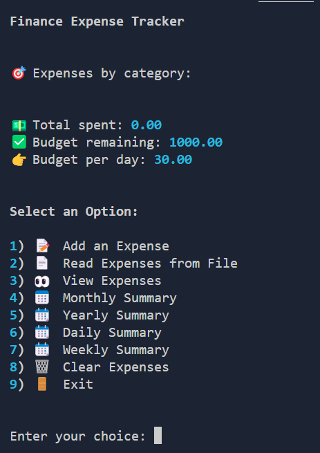
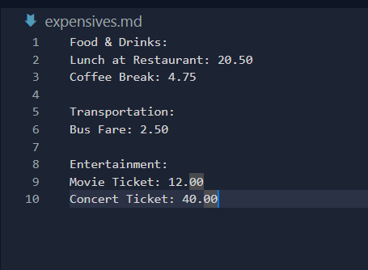
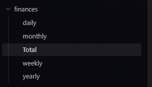
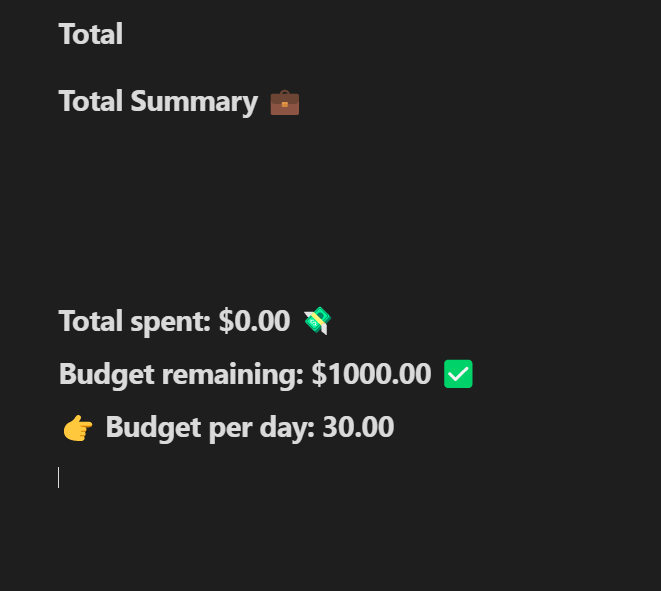

# Tutorial: Finance Expense Tracker - Installation and Usage Guide





In this tutorial, we will learn how to install and use the Finance Expense Tracker script. The Finance Expense Tracker is a command-line tool that helps you track your expenses by allowing you to add, view, and summarize your expenses. Let's get started!

## Step 1: Installation

To install the Finance Expense Tracker script, follow these steps:

1. Make sure you have Python installed on your computer. You can download the latest version of Python from the official website: [python.org](https://www.python.org/).

2. Download the script file named `finance.py` from [GitHub repository]([https://github.com/example/finance-expense-tracker](https://github.com/Ins8ne/Finance-Expense-Tracker/tree/main)).

3. Save the `finance.py` file to a directory of your choice.

## Step 2: Dependencies Installation

The Finance Expense Tracker script has some dependencies that need to be installed before running it. To install the required dependencies, follow these steps:

1. Open your command-line interface (e.g., Terminal for macOS/Linux or Command Prompt for Windows).

2. Navigate to the directory where you saved the `finance.py` file using the `cd` command.

3. Run the following command to install the dependencies:

```
pip install rich
```

## Step 3: Usage

Now that you have installed the Finance Expense Tracker script and its dependencies, let's explore how to use it.

1. Open your command-line interface (e.g., Terminal for macOS/Linux or Command Prompt for Windows).

2. Before running the script, you need to have an expenses.csv file in the same directory. The expenses file should be named expenses.csv and should follow this format:

```
Category,Expense
Budget,1000
Daily budget,30.0
```
You can change the values in this file according to your needs. This file will not be overwritten when you run the script.
  

3. Navigate to the directory where you saved the `finance.py` file using the `cd` command.

4. Run the following command to start using the Finance Expense Tracker:

```
python finance.py
```

6. The Finance Expense Tracker menu will be displayed with various options:

- Add an Expense: Allows you to add a new expense by providing the date, category, description, and expense amount.
- Read Expenses from File: Imports expenses from a file in the specified format.
- View Expenses: Displays a summary of expenses for the current day.
- Monthly Summary: Shows a summary of expenses for a specific month and year.
- Yearly Summary: Shows a summary of expenses for a specific year.
- Daily Summary: Shows a summary of expenses for a specific day, month, and year.
- Weekly Summary: Shows a summary of expenses for a specific week.
- Clear Expenses: Allows you to clear expenses based on different criteria (all, specific day, specific month, or specific year).
- Exit: Exits the Finance Expense Tracker script.

7. Choose an option by entering the corresponding number and pressing Enter.

8. Follow the instructions prompted by the script to perform the desired action.

9. Enjoy tracking your expenses with the Finance Expense Tracker!


## Using the `expensives.md` File with "Read Expenses from File" Option





The Finance Expense Tracker script allows you to import expenses from a file named `expensives.md`. This file should be in the same directory as the `finance.py` script. The `expensives.md` file should follow a specific format for the expenses to be imported correctly.

Here's how to use the `expensives.md` file with the "Read Expenses from File" option:

1. Create a new text file and name it `expensives.md`.

2. Open the `expensives.md` file using a text editor.

3. Follow the format below to add your expenses:

```
Category Name:
Expense Description: Expense Amount
Expense Description: Expense Amount
...

Category Name:
Expense Description: Expense Amount
Expense Description: Expense Amount
...
```

For example:

```
Food & Drinks:
Lunch at Restaurant: 20.50
Coffee Break: 4.75

Transportation:
Bus Fare: 2.50

Entertainment:
Movie Ticket: 12.00
Concert Ticket: 40.00
```

4. Save the `expensives.md` file in the same directory as the `finance.py` script.

5. Follow the steps mentioned in Step 3 of the Usage section to run the Finance Expense Tracker script.

6. In the Finance Expense Tracker menu, choose option 2 ("Read Expenses from File").

7. The expenses from the `expensives.md` file will be imported and added to your expense records.

8. You can now view, summarize, or perform any other actions on these imported expenses using other options in the Finance Expense Tracker menu.


---

## Viewing Summaries in Markdown Format

After each start of the Finance Expense Tracker, multiple summaries will be automatically generated and saved in Markdown format in the `/finances` folder. These files are overwritten each time you start the script. This allows you to easily view and share your most recent expense summaries.

Here's how the `/finances` folder and a daily summary file might look:






---

That's it! You can now import multiple expenses from a single file using the provided format, track them with the Finance Expense Tracker script, and view your summaries in a convenient Markdown format. Enjoy tracking your expenses!

That's it! You can use this method to import multiple expenses from a single file using the provided format and start tracking them with the Finance Expense Tracker script.
